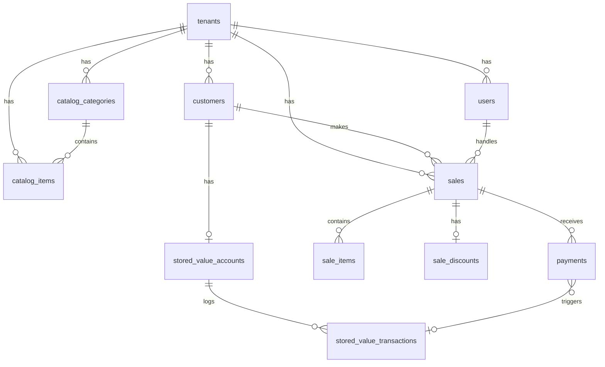

# Database Schema Specification

> DB 작업 시 이 문서를 참조하세요: `@docs/specs/database.md`

## Overview

- **DBMS**: PostgreSQL 16+
- **ORM**: ActiveRecord (Rails 8)
- **Multi-tenancy**: acts_as_tenant gem
- **총 테이블 수**: 12개

---

## Common Rules

1. 모든 테이블에 `tenant_id` 포함 (멀티테넌시)
2. 모든 테이블에 `created_at`, `updated_at` 포함
3. 금액은 `integer` (원 단위)
4. 상태값은 `string` (enum 대신)
5. JSON 데이터는 `jsonb` 타입 사용

---

## Tables

### 1. tenants (점포)

```ruby
create_table :tenants do |t|
  t.string :name, null: false
  t.string :timezone, default: 'Asia/Seoul'
  t.timestamps
end
```

**비즈니스 규칙**:
- MVP에서는 1개 tenant만 사용
- 모든 데이터는 tenant_id로 격리

---

### 2. users (직원/디자이너)

```ruby
create_table :users do |t|
  # Devise 기본 필드 (Phase 2 - 로그인 기능 시 활성화)
  t.string :email
  t.string :encrypted_password
  t.string :reset_password_token
  t.datetime :reset_password_sent_at
  t.datetime :remember_created_at

  # 기본 정보
  t.references :tenant, null: false, foreign_key: true
  t.string :name, null: false
  t.string :role, null: false, default: 'designer'
  t.string :phone
  t.string :color, null: false, default: '#00c875'

  # 인사 정보
  t.date :join_date
  t.date :resignation_date
  t.string :employment_status, default: 'active'  # active, resigned

  # 표시 설정
  t.boolean :show_in_sales, default: true    # 거래 입력 시 담당자로 표시
  t.integer :display_order, default: 0       # 표시 순서

  t.timestamps
end

add_index :users, [:tenant_id, :email], unique: true, where: 'email IS NOT NULL'
add_index :users, :reset_password_token, unique: true
add_index :users, [:tenant_id, :employment_status]
add_index :users, [:tenant_id, :show_in_sales]
```

**직급 (role)**:
| 코드 | 표시명 | 설명 |
|------|--------|------|
| `owner` | 원장 | 점포 소유자 |
| `manager` | 실장 | 관리자급 |
| `designer` | 디자이너 | 일반 시술 담당 |
| `intern` | 인턴 | 수습 |
| `staff` | 스탭 | 보조 인력 |

**재직 상태 (employment_status)**:
- `active`: 재직중
- `resigned`: 퇴사

**비즈니스 규칙**:
- `show_in_sales = true`인 직원만 거래 입력 화면에 표시
- `resignation_date` 입력 시 `employment_status`는 자동으로 `resigned`로 변경
- 퇴사 직원은 기존 거래 내역에서는 보이지만, 새 거래 담당자로 선택 불가

---

### 3. customers (고객)

```ruby
create_table :customers do |t|
  t.references :tenant, null: false, foreign_key: true
  t.string :name, null: false
  t.string :phone
  t.text :memo
  t.string :status, default: 'active'
  t.date :first_visit_at

  t.timestamps
end

add_index :customers, [:tenant_id, :phone], unique: true, where: 'phone IS NOT NULL'
```

**상태 (status)**:
- `active`: 활성
- `inactive`: 비활성
- `blocked`: 차단

**비즈니스 규칙**:
- `first_visit_at`은 첫 거래 저장 시 자동 설정
- 검색은 이름/전화번호 부분 일치

---

### 4. catalog_categories (카테고리)

```ruby
create_table :catalog_categories do |t|
  t.references :tenant, null: false, foreign_key: true
  t.string :name, null: false

  t.timestamps
end

add_index :catalog_categories, [:tenant_id, :name], unique: true
```

**예시 데이터**: 커트, 펌, 염색, 클리닉, 두피, 상품

---

### 5. catalog_items (시술/상품)

```ruby
create_table :catalog_items do |t|
  t.references :tenant, null: false, foreign_key: true
  t.references :catalog_category, foreign_key: true
  t.string :kind, null: false  # service, product
  t.string :name, null: false
  t.integer :base_price, default: 0
  t.boolean :active, default: true

  t.timestamps
end

add_index :catalog_items, [:tenant_id, :kind, :name], unique: true
```

**종류 (kind)**:
- `service`: 시술
- `product`: 상품

---

### 6. sales (거래 헤더)

```ruby
create_table :sales do |t|
  t.references :tenant, null: false, foreign_key: true
  t.references :customer, null: false, foreign_key: true
  t.references :staff, null: false, foreign_key: { to_table: :users }
  t.date :sale_date, null: false
  t.string :status, default: 'completed'
  t.text :note

  t.timestamps
end

add_index :sales, [:tenant_id, :sale_date]
add_index :sales, [:tenant_id, :staff_id]
add_index :sales, [:tenant_id, :customer_id]
```

**상태 (status)**:
- `completed`: 완료
- `voided`: 취소됨
- `refunded`: 환불됨

**계산 필드** (저장하지 않음, 조회 시 계산):
- `subtotal`: sum(items.line_total)
- `discount_amount`: 할인액
- `total`: subtotal - discount_amount

---

### 7. sale_items (거래 라인아이템)

```ruby
create_table :sale_items do |t|
  t.references :tenant, null: false, foreign_key: true
  t.references :sale, null: false, foreign_key: true
  t.references :catalog_item, foreign_key: true
  t.string :kind, null: false  # service, product, custom
  t.string :name, null: false
  t.integer :quantity, default: 1
  t.integer :unit_price, default: 0
  t.integer :line_total, default: 0
  t.jsonb :meta, default: {}

  t.timestamps
end
```

**종류 (kind)**:
- `service`: 시술
- `product`: 상품
- `custom`: 직접 입력

**비즈니스 규칙**:
- `line_total = quantity * unit_price` (서버에서 계산)

---

### 8. sale_discounts (할인)

```ruby
create_table :sale_discounts do |t|
  t.references :tenant, null: false, foreign_key: true
  t.references :sale, null: false, foreign_key: true
  t.string :discount_type, null: false  # percent, amount
  t.integer :value, null: false
  t.string :reason

  t.timestamps
end
```

**할인 유형 (discount_type)**:
- `percent`: 퍼센트 (0~100)
- `amount`: 금액 (원)

**계산 규칙**:
```ruby
if discount_type == 'percent'
  discount_amount = (subtotal * value / 100).floor
else
  discount_amount = value
end
```

---

### 9. payments (결제)

```ruby
create_table :payments do |t|
  t.references :tenant, null: false, foreign_key: true
  t.references :sale, null: false, foreign_key: true
  t.string :method, null: false
  t.integer :amount, null: false
  t.datetime :paid_at, default: -> { 'CURRENT_TIMESTAMP' }
  t.jsonb :meta, default: {}

  t.timestamps
end
```

**결제수단 (method)**:
| 코드 | 표시명 | 설명 |
|------|--------|------|
| `cash` | 현금 | 현금 결제 |
| `card` | 카드 | 신용/체크카드 |
| `transfer` | 계좌이체 | 무통장입금, 이체 |
| `stored_value` | 정액권 | 충전된 잔액에서 차감 |
| `giftcard` | 상품권 | 일회성 상품권 |
| `other` | 기타 | 기타 결제 |

---

### 10. stored_value_accounts (정액권 잔액)

```ruby
create_table :stored_value_accounts do |t|
  t.references :tenant, null: false, foreign_key: true
  t.references :customer, null: false, foreign_key: true
  t.integer :balance, default: 0

  t.timestamps
end

add_index :stored_value_accounts, [:tenant_id, :customer_id], unique: true
```

**비즈니스 규칙**:
- 고객당 1개 계정만 존재
- balance는 0 이상

---

### 11. stored_value_transactions (정액권 원장)

```ruby
create_table :stored_value_transactions do |t|
  t.references :tenant, null: false, foreign_key: true
  t.references :stored_value_account, null: false, foreign_key: true
  t.references :sale, foreign_key: true
  t.references :payment, foreign_key: true
  t.string :tx_type, null: false
  t.integer :amount, null: false  # +충전, -차감
  t.text :memo

  t.timestamps
end
```

**트랜잭션 타입 (tx_type)**:
| 타입 | 설명 | 금액 부호 |
|------|------|----------|
| `topup` | 충전 (구매) | + |
| `redeem` | 소진 (사용) | - |
| `adjust` | 수동 조정 | +/- |
| `refund` | 환불 | + |

---

### 12. audit_logs (감사 로그)

```ruby
create_table :audit_logs do |t|
  t.references :tenant, null: false, foreign_key: true
  t.references :actor, foreign_key: { to_table: :users }
  t.string :action, null: false
  t.string :entity_type, null: false
  t.bigint :entity_id, null: false
  t.jsonb :diff, default: {}

  t.timestamps
end

add_index :audit_logs, [:tenant_id, :entity_type, :entity_id]
```

**기록 대상 액션**:
- `sale.create`, `sale.update`, `sale.void`
- `customer.create`, `customer.update`
- `payment.create`
- `stored_value.redeem`, `stored_value.adjust`

---

## ER Diagram (Mermaid)



---

## Migration Order

마이그레이션은 다음 순서로 실행해야 합니다:

1. `tenants`
2. `users` (Devise)
3. `customers`
4. `catalog_categories`
5. `catalog_items`
6. `sales`
7. `sale_items`
8. `sale_discounts`
9. `payments`
10. `stored_value_accounts`
11. `stored_value_transactions`
12. `audit_logs`
